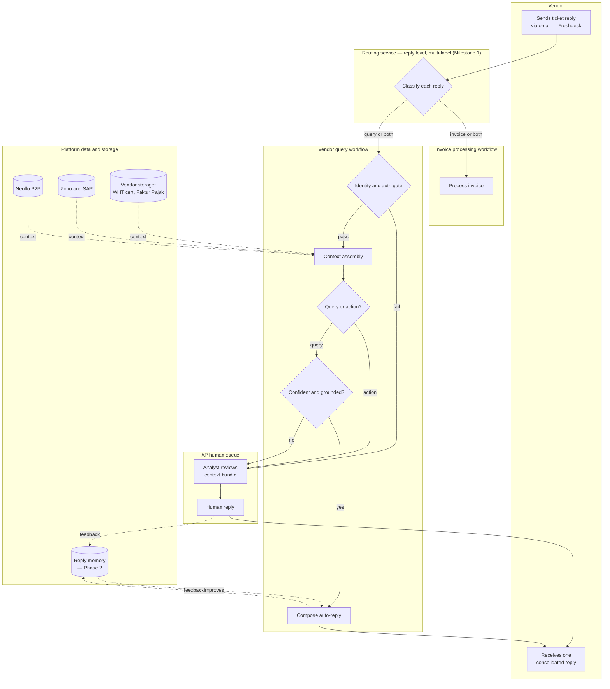

# Vendor Queries — PRD

<aside>
💬

**Status:** Ready for review

**Owner:** Shubham Shrivastava (Product)

**Stage:** Problem agreed, solution scoped, ready for eng/design grooming

**Last updated:** 20 June 2026

</aside>

<aside>
🧭

**Reading guide by audience.** Execs / Sales / Marketing → §0 (TL;DR) and §15 (GTM). Product / Eng → §6 (scope), §7 (architecture), §8 (functional requirements), §10 (data & integrations), §11 (NFRs). Design → §5 (users), §9 (UX & states). CS / Implementation → §4 (metrics), §14 (rollout & support). Everyone should read §0 and §4.

</aside>

---

# 0. TL;DR

<aside>
🎯

**In one sentence:** A platform that sits between a company's vendors and its accounts-payable (AP) team, automatically answering the high-volume "where's my payment?" class of questions the system already knows the answer to — gated by a strict identity check — and routing the genuinely hard ones to a human with all the context pre-assembled.

</aside>

**The problem.** Roughly 4 out of 5 vendor questions to an AP team are simple status checks the system already holds the answer to, but a human still stops, looks them up across several systems, and replies. That cumulative drain is the cost.

**The product.** For every inbound vendor question, the platform: (1) **verifies who's asking** before revealing anything, (2) **assembles the facts** (right legal entity, currency, invoice, PO, payment, tax), and (3) **attempts a grounded answer** — if it can produce one with high confidence, it replies; if not, it hands the query to a human with the context already attached. Bank-detail changes are captured for a human to verify, never auto-applied.

**Why now / why us.** It runs on the same Neoflo platform as our [P2P invoice-processing workflow](https://app.notion.com/p/P2P-MVP-Invoice-Processing-2fd1bfb492548070a2edecb6a460ccae?pvs=21) — so it can draw on live invoice stage/status, rejection reasons, payment data, and tax amounts the platform already handles, plus the vendor master from the customer's ERP/SAP. For multi-entity, multi-currency customers like [Zalora](https://app.notion.com/p/Zalora-Phase-1-PRD-3191bfb4925480df90bedcac8dfe5cab?pvs=21) — the same supplier billed across several legal entities and currencies — that grounding is the moat.

**v0 in one breath.** Identity-and-authorization gate (the anchor) → automatic answers for **payment status, payment breakdown, document requests, and invoice-receipt status** → human handoff for everything else, context attached → bank-detail requests captured and routed → everything logged and measured from day one. Tax certificates are served automatically when on file in vendor-level storage, otherwise routed to a human (auto-fetch from government portals is a later build); tax-rate explanations and statement reconciliation are stretch goals.

**Headline success metric.** **Containment rate** — the share of in-scope vendor questions resolved without a human. **Phase 1 target is 40%**, validated against the Phase 0 baseline rather than guessed. Two non-negotiable guardrails hold from day one: **zero unauthorized disclosures** and **zero fraudulent bank-detail changes applied.**

**Who asked for it.** This isn't a hypothesis we went looking to justify — **Zalora has requested vendor-query handling as part of their Phase 3.** That makes Zalora both the design partner and the first customer for v0. The product stays generic; Zalora is the proving ground.

---

# 1. How this fits the Neoflo platform

## 1.0 The strategic bet

<aside>
♟️

**Why this is the right next build.** Two reinforcing reasons, both grounded in something real rather than a market guess:

- **Expand within P2P accounts.** Customers already running our invoice-processing workflow have the data (invoice status, payments, tax, vendor master) that makes vendor-query answers possible. This is a natural upsell that deepens the platform's hold on the AP function.
- **A wedge into new accounts.** For AP teams not yet on our P2P product, vendor-query pain is a sharp, standalone entry point that can lead back to the core workflow.
</aside>

This product is **not** a standalone help desk. It is a new surface on the existing Neoflo platform, deliberately scoped to *consume* what the platform already produces rather than rebuild it.

| Capability | Who owns it | How Vendor Queries uses it |
| --- | --- | --- |
| Invoice stage/status + rejection reasons | P2P Invoice Processing workflow / ERP | Source of truth for "where is my invoice / why is it stuck" |
| Payment + remittance (post-posting, from SAP's payment run) | ERP — **per-client integration** (read path exists for Zalora; every client's SAP differs; produced *after* invoice processing — see §10.1) | Source for payment status and payment-breakdown answers |
| Tax amounts (WHT/VAT) — extracted and posted | ERP / invoice-processing extraction | Source for tax-rate explanations and breakdowns |
| Vendor master (identity seed) | Customer ERP, **seeds a platform-owned authorization registry** | Starting point for **identity & authorization** — but the platform owns the registry (see Epic B), because some authorised askers won't exist in the ERP master |
| Duplicate Detection (Invoice # + Vendor + Legal Entity) | P2P Invoice Processing Workflow | Already prevents duplicate payments upstream — **out of scope here** |
| Post-processing vendor email ("invoice processed") | P2P Invoice Processing Workflow | Basic proactive notification — **owned there, not here** |
| Freshdesk integration & ticket status sync | Zalora Phase 1 integration | Shared intake channel and status-sync pattern we reuse |

<aside>
📐

**Design principle inherited from the platform:** *configuration over code.* Thresholds, matching rules, languages, SLAs, and which question types are enabled are all workflow-configurable — consistent with the P2P and Zalora PRDs.

</aside>

## 1.1 The opportunity (business case)

Three ways this pays off, each tied to numbers we confirm in Phase 0 rather than guess now:

- **Cost we take out.** AP teams spend hours every week on look-up questions (§2.1). Containment converts most of that to near-zero-touch — the value is roughly *(contained volume) × (loaded minutes per manual reply)*, which we size from Zalora's real volume in Phase 0.
- **Expansion inside existing accounts.** Every customer already on our P2P invoice workflow is a candidate; this deepens our hold on their AP function and is a natural upsell (§1.0).
- **A wedge into new accounts.** Vendor-query pain is sharp enough to enter on its own, then lead back to the core P2P product.

The pricing model is still open (§13.9), and the number customers watch is containment (§4.1). We deliberately don't put a TAM/ARR figure here until Phase 0 gives real volume to base it on — a guessed number would be worse than none.

---

# 2. The problem

<aside>
🔑

**Key insight: vendor questions are a symptom, not the disease.** The flood is really three problems wearing one uniform, each needing a different fix: a **volume problem** (many simple "where's my payment?" questions that shouldn't need a human), a **root-cause problem** (a smaller number of real exceptions caused by something breaking upstream — split into vendor-raised disputes like "you underpaid me" and internal exceptions the vendor isn't aware of, like an invoice stuck on an unmatched PO), and a **trust/security problem** (replying to the wrong person is a data leak; bank-detail-change requests are a fraud vector). Beneath all three: **vendors only ask because no one tells them anything first.** Silence creates the questions.

</aside>

## 2.1 Where the time and money go

- **~80% of vendor questions are simply "has it been paid yet?"** — only ~1 in 5 is a real problem worth an expert's time. ([VendorInfo](https://vendorinfo.com/tips-best-ap-vendor-service/))
- **Volume eats real capacity.** 43% of AP teams spend six or more hours every month just answering vendor questions; some spend 20+. ([MineralTree — State of AP](https://www.mineraltree.com/blog/blog-how-to-respond-to-vendor-inquiries/))
- **Inquiry-handling time is a recognised efficiency lever** — every hour spent looking answers up is an hour not spent on higher-value finance work. ([MineralTree — AP KPIs](https://www.mineraltree.com/blog/three-kpis-every-team-should-measure/)) A per-interruption refocus cost (~23 min) compounds it, though for quick look-ups the dominant cost is volume. ([Gallup / UC Irvine](https://news.gallup.com/businessjournal/23146/too-many-interruptions-work.aspx))
- **Each manual touch is expensive.** The same hand-done, multi-system effort that makes an invoice cost $12–$40 to process (vs $1–$5 automated) is what every vendor query triggers. ([HighRadius](https://www.highradius.com/resources/Blog/ap-cost-per-invoice/))
- **Vendors hate it too.** Chasing invoice status is suppliers' single biggest payment-process frustration; 44% feel AP teams don't respond well. ([MineralTree](https://www.mineraltree.com/blog/blog-how-to-respond-to-vendor-inquiries/))

## 2.2 Why the questions exist (upstream causes)

Many "real" questions only exist because something broke earlier. Nearly **a third (31%) of PO-based invoices can't be approved as they arrive and need manual rework first**, and **88% of hand-processed AP documents contain an error**. ([CTMfile](https://ctmfile.com/story/eliminating-invoice-exceptions-is-one-of-the-most-effective-ways-for-accoun), [CostBits / MHC](https://costbits.com/costbits-insights/uncovering-irregularities-in-accounts-payable)) Many can't be answered by AP alone — they need procurement, receiving, or tax. *(The classic downstream symptom — paying the same invoice twice — is a processing/SAP-layer problem, already prevented upstream by Duplicate Detection in the [invoice-processing workflow](https://app.notion.com/p/P2P-MVP-Invoice-Processing-2fd1bfb492548070a2edecb6a460ccae?pvs=21), not by this product.)*

## 2.3 Risk & trust

Every answer reveals financial information, so replying to the wrong person is a data leak. The sharpest risk is the bank-detail change: a fraudster impersonates a supplier and asks to "update our bank account." This is not rare — **79% of companies faced payment-fraud attempts in 2024; 63% rank email impersonation as their single biggest fraud threat**, average fraudulent request ~$24,586. ([Zenwork](https://www.zenwork.com/payments/blog/types-of-accounts-payable-fraud-to-watch-in-2025/), [AFP / Truist](https://www.financialprofessionals.org/training-resources/resources/articles/Details/what-treasury-professionals-need-to-know-about-business-email-compromise-in-2025), [Hoxhunt](https://hoxhunt.com/blog/business-email-compromise-statistics)) This is *why the identity gate, not a bank-change feature, is the v0 anchor.*

## 2.4 The multi-country dimension (e.g. Zalora)

A large customer buys from the same supplier through several legal entities, currencies, and countries — so "where's my payment?" can't be answered until we know *which* entity and currency. Questions arrive in several SEA languages. Tax and reconciliation questions are a **top category, not an edge case** (tax-certificate requests, statement reconciliations, withholding-rate disputes), and many have exact, rule-based answers — good automation candidates.

<aside>
⚠️

**Evidence caveat.** Every number above is third-party industry research (mostly US / mid-market), *not* our own customers. Treat as directional. Phase 0 validates it two ways: (1) against a real customer's support-desk history (e.g. Zalora's), and (2) by talking to customer AP teams to confirm the problem and the question mix.

</aside>

## 2.5 Who feels it

- **AP analyst** — lives the interruption tax; pulled off real work to look up answers the system already holds.
- **Vendor** — in the dark about money owed; can't find out without chasing a human.
- **AP manager** — has two problems: *no numbers to manage by* (can't see volume, mix, or time spent), and a rare-but-expensive *fraud tail risk* if an impersonator gets bank details changed.
- **Internal colleague** — currently the unwilling go-between for vendor and AP.
- **Tax / treasury** — wants tax-certificate and rate questions answered without landing on their desk.

---

# 3. Goals & non-goals

## 3.1 Goals

1. Cut the human effort spent per vendor question (raise containment).
2. Let vendors self-serve anything the system already knows — faster answers, fewer chases.
3. Ensure every answer and change request reaches **only an authorised asker** — close the disclosure and impersonation paths.
4. Create the measurement baseline that doesn't exist today.

## 3.2 Non-goals (v0)

- **Settling disputes automatically** — genuine disagreements go to a person.
- **Auto-updating vendor records** — v0 only *captures and routes* bank-detail/address changes; a human verifies and applies.
- **Owning proactive "invoice processed" notifications** — that lives in the invoice-processing workflow. Richer proactive payment-status messaging is Phase 2.
- **Multi-language replies** — Phase 1 replies are **English-only**; multi-language is a later phase. (Inbound can arrive in any language; only the outbound reply is English-bound in Phase 1.)
- **VIP/tiered SLAs** — uniform handling in v0.
- **A vendor self-service portal** — v0 meets vendors on email (see §15 decision log).

---

# 4. Success metrics & instrumentation

<aside>
📊

**Principle:** every metric below has a precise definition, a provisional target, and a named instrumentation source. Targets marked *provisional* are confirmed against the Phase 0 baseline before go-live. All events are logged from day one.

</aside>

## 4.1 North-star

| Metric | Definition | Target (provisional) | How measured |
| --- | --- | --- | --- |
| **Containment rate** | In-scope queries resolved with **no human touch** ÷ all in-scope queries | 40% (Phase 1 target; validated in Phase 0) | Query records where resolution = auto and human_touch = false |

## 4.2 Supporting metrics

| Metric | Definition | Target (provisional) | How measured |
| --- | --- | --- | --- |
| **Routing accuracy** | % of inbound replies routed to the correct workflow(s) — vendor-query / invoice / both | **98%** | Routing decisions vs the manually-labelled ground-truth set (Phase 0); ongoing human audit sample |
| Automation rate by type | % auto-resolved within each question type | TBD after Phase 0 baseline | Query records grouped by intent_type |
| Time to first response | Intake → first reply sent | Auto: median under 2 min | Timestamps on query record |
| Time to resolve | Intake → terminal state (answered/closed) | Auto: median under 5 min; routed: tracked vs SLA | Timestamps on query record |
| Coverage / ingestion rate | % of inbound vendor messages parsed into a structured query | ≥ 90% | Intake logs vs raw inbound count |
| Trackable-channel share | % of queries via a trackable channel (vs untraceable phone) | Increasing trend | source field on query record |

## 4.3 Quality & guardrails

| Metric | Definition | Target | How measured |
| --- | --- | --- | --- |
| **Auto-answer accuracy** | Sampled auto-answers judged correct by QA | **95%+** (treated almost like a hard limit; validated against the Phase 0 baseline) | QA sample + behavioral signals (re-ask/reopen, silence, reply sentiment) + human corrections — see §4.4 |
| **Unauthorized disclosure** (hard guardrail) | Answers sent to an asker who failed authorization | **0** | Every outbound answer must carry a passing auth_check_id |
| **Fraudulent bank-detail changes applied** (hard guardrail) | Bank-detail changes applied without human verification | **0** | Bank-change events are capture-only; no write path in v0 |
| Auth-gate coverage | Outbound answers preceded by a successful identity check | 100% | Schema constraint: answer blocked without auth_check_id |
| **Audit coverage** (hard guardrail) | State-changing actions (system or human) with an immutable audit record | **100%** | Schema constraint: no action commits without an audit entry (VQ-K1) |
| Vendor re-ask rate (counter-metric) | Same vendor re-asks the same query within 7 days | under 10% | Thread/intent clustering on query records |
| Vendor satisfaction proxy (counter-metric) | Satisfaction on resolved queries, **inferred** — the email channel has no rating surface, so direct CSAT isn't collectable in Phase 1 | Establish baseline, then improve | Reply sentiment + dispute/reopen rate + re-ask rate (direct CSAT only if a vendor surface is added later) |

<aside>
🧪

**Counter-metrics matter:** containment must not be "won" by frustrating vendors into giving up. Re-ask rate and the inferred satisfaction proxy are tracked alongside containment and reviewed together.

</aside>

## 4.4 How auto-answer accuracy is measured

In production we rarely get a clear right/wrong verdict on each reply, so we estimate accuracy from three signals, listed from least to most reliable:

1. **QA sample — the official number.** A weekly random sample of auto-answers is judged correct/incorrect by QA. This unbiased estimate is what the 95%+ target is held to.
2. **What the vendor does next — the day-to-day read between QA samples.** For each answer, tracked automatically over email: a **re-ask / reopen** (the vendor replies again or re-asks the same intent within N days) is a negative signal — the reopen already routes to a human (VQ-A2); **silence** within the window is a weak positive; and **sentiment of any follow-up reply** ("thanks, got it" vs "this is wrong") gives a directional read. There is no in-email CSAT widget — tickets are auto-created from email, so there's no surface for a one-click rating; satisfaction is inferred from these behaviours.
3. **Human correction — the most reliable signal.** When a reopened/disputed query reaches a human and the human's answer differs materially from what we auto-sent, that query is logged as a **confirmed** inaccuracy — ground truth at no extra QA cost.

The QA sample sets the headline accuracy; the other two give an early warning if accuracy starts slipping, and feed reply memory (Epic O) so the same mistake isn't repeated. **Caveat:** re-ask is a proxy, not proof — vendors sometimes re-ask for unrelated reasons or stay silent on a subtly wrong answer — so the QA sample remains the source of truth, with the live signals as the early-warning layer.

---

# 5. Users & jobs-to-be-done

| Persona | Job-to-be-done | What v0 gives them |
| --- | --- | --- |
| **Vendor** (supplier) | "Tell me where my money is without making me chase a human." | Fast, accurate auto-answers (English replies in Phase 1) |
| **AP analyst** | "Stop interrupting me with questions the system can answer; when something real reaches me, give me everything I need." | ~80% deflected; escalations arrive with a pre-assembled context bundle + suggested next step |
| **AP manager** | "Give me numbers to manage by, and make sure no fraudulent bank-change ever slips through." | Containment/accuracy dashboard; identity gate + zero-fraud guardrail |
| **Internal colleague** (easily forgotten) | "Stop making me the messenger between the vendor and AP." | Vendors get answers directly; fewer internal chase requests |
| **Tax / treasury** (critical for APAC) | "Tax-certificate and rate questions shouldn't land on my desk." | Tax-cert requests served from vendor storage when on file, else routed with context (auto-fetch from portals is later); rule-based rate explanations (stretch) |

---

# 6. Scope: question taxonomy & v0 prioritization

Every question type scored on volume, value, automatability, and strategic fit. Section 8 builds only the rows marked **Build now** (and stretch where data allows).

<aside>
📊

**Caveat:** the "how often" figures in this table are **not yet from our own customers** — they're external industry research plus our judgment (full list in §17). Phase 0 replaces them with the real question mix from a customer's own support-desk history (e.g. Zalora's) before scope is locked.

</aside>

| Question type | Auto-answerable? | Primary data source | v0 decision | Reasoning |
| --- | --- | --- | --- | --- |
| **Payment status** — "where's my money?" | Yes | Invoice status (Neoflo) + payment lifecycle (SAP: open → due → blocked → initiated → cleared) | **Build now** — the anchor | Biggest volume; system has the answer; moves containment most. "Paid" only at cleared (see §10.1 / VQ-E1) |
| **Payment breakdown** — "what does this payment cover?" | Yes | Remittance from SAP's payment run (not the bank) | **Build now** | Same answering engine as status |
| **Short-pay / deduction / credit note** — "you paid me less than I invoiced" | No — route in v0 | Payment doc + remittance (deductions, WHT, credit notes) — *if* retained readably | **Route to human** (Build-now candidate once remittance read is proven) | Very common and trust-sensitive. The breakdown engine (VQ-E2) often *has* the answer ("less $X WHT / credit note CN-12"), but until Phase 0 proves remittance is readable, route with context rather than risk a wrong "why" |
| **Invoice not received / no record** — "did you get my invoice?" | Yes via lookup cascade; a "no record" conclusion routes to human | Invoice-processing workflow (if the client runs it); else ERP (SAP/Zoho) by invoice ID | **Build now (cascade)** | Cascade: (1) if the client uses our invoice-processing workflow, read the invoice's intake/processing state there; (2) else query the ERP (SAP/Zoho) for the invoice ID; (3) if neither resolves it, route to a human. A confident "received — here's its state" is auto-answered; a **"no record" conclusion still routes to a human**, since a false negative makes the vendor resubmit (duplicates) when the invoice may be mid-processing, lagging in sync, or under a different entity |
| **Document request** — "send the PO / payment proof" | Yes, if on file | Stored invoice PDF, PO, SAP doc | **Build now** | Look-up-and-send pattern |
| **Tax certificate** — "send my WHT/TDS certificate" | Auto if on file in vendor storage; else route | Vendor-level storage (Epic N) if uploaded; otherwise a person pulls it from a government portal | **Build now (storage-backed)** | Vendor-level storage lets AP staff upload WHT/TDS certs and Faktur Pajak. Once on file, a cert request is the same look-up-and-send pattern as document requests (VQ-E3). Auto-fetch from the govt portal stays a later build |
| **Bank-detail change** — "update our account" | No — needs a human | Captured to query record | **Capture & route** (verification flow deferred) | Very low volume, always human; identity gate already blocks impersonation |
| **Tax-rate question** — "why 2% not 1%?" | Partly — rule-based | WHT/VAT amount (invoice or ERP/Neoflo(if already processed)) + tax rule + vendor tax status | **Stretch** (explain; escalate if it doesn't reconcile) | Answer follows fixed rules, so explainable |
| **Statement reconciliation** — "why only 5 of 10 paid?" | Partly | Invoice statuses + rejection reasons (Neoflo) | **Stretch** (depends on data access) | Listing statuses is easy; explaining why one is stuck needs stage/reason data |
| **Genuine dispute** — "you underpaid me" | No — needs judgment | Context bundle for human | **Route to human** | Symptom of an upstream issue; automating judgment is wrong |
| Anything unclear | No | — | **Route to human** | Catch-all |

**Thesis in one line:** auto-answer the high-volume questions the system already knows, explain the rule-based tax ones, capture bank changes safely, and route everything needing judgment to a human with context pre-assembled — all behind a strict identity gate.

## 6.1 Queries vs actions

Every inbound request is one of two kinds, and the kind decides whether automation is even *allowed*:

- **Queries** — informational / read-only ("where's my payment?", "send the PO", "why 2% WHT?"). A query **may be auto-answered** when grounded and confident, or **routed to a human** when not.
- **Actions** — state-changing requests ("update our bank account", "change our address", "cancel this invoice"). An action is **always routed to a human**, regardless of confidence. It's the same rule we already use for bank-detail changes (Epic I), applied to every state-changing request.

*How this fits Epic D's "don't label the question first" rule:* spotting an action is only ever used to **hold something back** (send it to a human), never to **write** an answer. So it stays safe — the worst a wrong guess can do is send a person something we could have answered automatically; it can never cause a wrong auto-reply. Queries still follow the normal path: answer when confident, otherwise route.

The §6 "v0 decision" column is the **default** per-intent handling; each tenant can override it to automated, human, or off via config (VQ-L3) — except that actions are always human.

---

# 7. Solution overview & architecture

**In one sentence:** the platform meets vendors on the channel they already use, confirms who's asking, assembles the facts from Neoflo + ERP, classifies intent, then answers / explains / reconciles / routes / captures — and logs everything.

## 7.0 High-level flow

Every **new ticket and every new reply** on an existing ticket runs the same four steps:

1. **Classify the workflow(s) to trigger.** A ticket or reply may contain an **invoice**, a **query / action**, or **both** — route to the invoice-processing workflow, the vendor-query workflow, or **both** (multi-label; Epic M).
2. **In the vendor-query workflow, classify query vs action** — informational *query* vs state-changing *action* (§6.1).
3. **Query →** auto-answer if grounded and high-confidence, otherwise route to a human (§7.2 gates).
4. **Action →** always routed to a human, regardless of confidence.

Everything sits behind the identity gate (G1) and is logged; the swim-lane in §7.1 shows the full path.

## 7.1 Routing service & end-to-end flow

In front of the vendor-query workflow sits a shared **routing service** (Epic M): a ticket has many replies, and the service classifies **every new ticket and each new reply** and routes it to the vendor-query workflow, the invoice-processing workflow, or **both** (multi-label). It is built workflow-agnostic so additional workflows on the same tenant plug in later without changing intake. Low-confidence routing defaults to a human triage queue. The swim-lane below shows the full path end to end.

## 7.2 Resolution decision (cascading gates, mirrors P2P Smart Routing)

| Gate | Condition to auto-resolve | If it fails |
| --- | --- | --- |
| **G0 — Action vs query** | The request is a *query* (informational). An *action* (state-changing: bank-detail / address change, cancel) never auto-resolves | Route to human regardless of confidence (see §6.1) |
| **G1 — Identity** | Sender maps to a known vendor contact AND is authorised for the entity/records in question | No disclosure; safe verify-yourself reply for recoverable cases, route to human for sensitive / suspicious (VQ-B4) — hard block |
| **G2 — Answerability** | The request maps cleanly to records the system can stand behind (not a dispute, not ambiguous) | Route to human |
| **G3 — Data completeness** | All records needed for the answer are present and live | Route to human, or hold and explain "in progress" |
| **G4 — Answer confidence** | Composed answer passes type-specific validation (e.g. reconciles) | Route to human rather than guess |

<aside>
🛡️

**G1 is absolute.** No answer, document, or amount leaves the system without a passing identity check recorded on the query. This is the single most important safety property of the product.

</aside>

## 7.3 Three non-negotiables

- **Knowing who's allowed to ask** — identity + authorization before anything is revealed (the v0 anchor), via a platform-owned, ERP-seeded registry (Epic B).
- **Getting entity & currency right** — for a multi-entity customer, an answer to the wrong entity isn't incomplete, it's *wrong*.
- **Recording & measuring from day one** — to prove containment moved and defend every answer given.

## 7.4 Query lifecycle (states & transitions)

The states design must cover (§9.6) and engineering implements, with what moves each one forward. Default everywhere: when unsure, route or hold — never guess.

| State | What it means | Moves to |
| --- | --- | --- |
| **New** | Intake created the Query record from an inbound message | Authorising |
| **Authorising** | Running the identity gate (G1) | Assembling (pass) · Auth failed (fail) |
| **Auth failed** | Sender not verified — safe, non-disclosing reply, or routed if sensitive/suspicious (VQ-B4) | Closed (safe reply) · Routed to human |
| **Assembling** | Resolving entity/currency and fetching records (Epic C) | Auto-answered · Awaiting data · Routed to human |
| **Awaiting data** | A needed record isn't ready yet (e.g. not yet posted) | Auto-answered / Routed once it resolves or times out |
| **Auto-answered** | Grounded, confident answer sent — no human touched it | Closed · Reopened |
| **Routed to human** | In the shared queue with a context bundle and an assignee | Closed (human replied) |
| **Bank-change captured** | State-changing action recorded; step-up triggered (Epic I) | Routed to human |
| **SLA breached** | Past its deadline — an attention flag, not a dead end | Stays Routed; surfaced for attention |
| **Closed** | Resolved, read-only, full audit visible | Reopened (on a new inbound reply) |
| **Reopened** | A post-close vendor reply re-opened the thread (never silently re-auto-answered) | Routed to human |

---

# 8. Functional requirements

<aside>
🧱

**Format.** Epics group user stories (VQ-x#) with testable acceptance criteria. Bold epics are v0; stretch epics are marked. Field/threshold specifics are tenant-configurable (Epic L).

</aside>

## Epic A — Intake & channel (v0)

**VQ-A1 · Email/Freshdesk ingestion** — *As the platform, I want to turn every inbound vendor message into a structured Query record so it can be processed and tracked.*

1. Receive vendor messages from configured channels (email inbox and/or Freshdesk webhook, reusing the Zalora pattern).
2. Create a Query record: source, sender, timestamp, workflow (the customer's vendor-query workflow; "tenant" and "workflow" are the same boundary in P0), raw body, attachments, unique ID.
3. Workflow routing (vendor-query vs invoice-processing, or both) is decided by the routing service (Epic M); intake creates the Query record for whatever is routed to this workflow and safely logs non-queries.
4. One message may contain multiple distinct questions — each becomes its own resolvable intent on the record.
5. *Acceptance:* ≥90% of inbound vendor messages produce a structured Query record; non-queries are logged, not dropped.

**VQ-A2 · Threading & dedupe**

<aside>
📬

**P0 is single-channel: email (via Freshdesk), the channel Zalora already uses.** The architecture is channel-agnostic so more channels can plug in later, but v0 builds and validates one channel only. The cross-channel merge below is therefore a *design-for-later* note, not a P0 build item.

</aside>

1. Link follow-ups to the original thread; never open a duplicate query for the same thread.
2. **Reopen on post-close reply.** If a vendor replies to an already-closed query — including disputing a closed auto-answer ("that's wrong") — the message threads to the *same* query (no new record) and the query reopens and routes to a human (Closed → Routed). The system never silently re-auto-answers a query the vendor has pushed back on: a post-close reply is treated as low-confidence / dispute (G2) by construction, with the original answer and assembled context attached for the analyst. The reopen fires the re-ask signal (§4.3). "Closed" is therefore terminal *until* a new inbound message arrives on the thread, not permanently final.
3. *(Later, multi-channel)* detect the same question arriving on two channels and merge.
4. *Acceptance (P0):* a vendor replying twice on one email thread yields one open query, not two; and a reply to a closed query reopens that same query and routes it to a human, rather than opening a new query or re-auto-answering.

## Epic B — Identity & authorization gate (v0 — the anchor)

<aside>
🔐

**The authorization registry is platform-owned, ERP-seeded.** The ERP vendor master is the *seed* for who a vendor's contacts are — but it isn't sufficient on its own, because real vendor organisations have people who need visibility (a new AP clerk, a finance lead, a shared mailbox) who were never entered in the customer's ERP. So the platform owns its own **authorization registry**: seeded from the ERP vendor master, then extended and maintained on-platform, scoped per legal entity. This is a real v0 build, not a lookup against the ERP. *(It also dovetails with the shared user/assignment capability in Epic H — same underlying notion of platform-managed access.)*

</aside>

**VQ-B1 · Sender → authorised-contact match** — *As the platform, I want to confirm the sender is a known, authorised contact for the vendor before revealing anything.*

1. The asker is identified by their **email address** (v0), matched against the **platform authorization registry** (seeded from the ERP vendor master, extended on-platform).
2. Produce an auth_check result: pass / fail / needs_step_up, with the matched vendor_id and authorised scope.
3. *Acceptance:* no downstream answer can be composed without a pass (schema-enforced).

**VQ-B2 · Authorization scope (workflow-level in P0)**

<aside>
🔑

**P0 decision — access is at the workflow level, not per legal entity.** In P0 an authorised contact is authorised for the *workflow* (i.e. that customer's vendor-query workflow); we do **not** build per-legal-entity access control. **But the *answer* must still respect the legal entity the vendor is asking about** — entity is a *data-fetch and answering* concern (Epic C), not an access-gate concern. So: the gate decides "can this person be answered at all?" at the workflow level; the answer engine then fetches and replies for the specific entity/invoice in question. Per-entity *access restriction* is a later phase.

</aside>

1. In P0, resolve whether the asker is an authorised contact for the workflow; restrict answers to that vendor's own records.
2. Entity is handled downstream (Epic C): the answer is scoped to the entity the query is about, even though access isn't gated per entity.
3. *Acceptance:* a vendor can only ever receive their own records; and an answer about Entity A never returns Entity B's figures.

**VQ-B3 · Step-up / out-of-band for sensitive requests**

1. For sensitive intents (e.g. bank-detail change), require confirmation through an independent channel already on file (e.g. a phone number from the vendor master, never one supplied in the message).
2. *Acceptance:* sensitive intents cannot proceed on inbound-message trust alone.

**VQ-B4 · Unknown / failed-auth handling**

1. **Reveal nothing.** The outbound reply never confirms or denies that a vendor, invoice, or account exists, never contains financial data, and is **identical whether or not the sender matches any record** (so it can't be used to enumerate vendors or invoices).
2. **Recoverable failure → safe automated reply with a path.** For an ordinary unverified sender (a likely-legitimate contact not yet in the registry, or a wrong address), send a generic, non-disclosing message: we can only share account details with verified contacts, and here's how to get verified (e.g. reply from the registered address, or ask the AP admin to add the contact). Keeps it from being a dead end without leaking anything.
3. **Sensitive or suspicious → route to a human, no auto-reply.** Any failed-auth on a sensitive intent or **action** (bank-detail / address change — already always-human, §6.1 / VQ-B3), repeated failed attempts, or a plausible-but-mismatched identity routes to a human — to onboard a genuine new contact or screen an impersonator. Never auto-resolved.
4. **Rate-limit and log.** Throttle failed-auth replies so they can't be used as an enumeration oracle, and log the attempt with reason.

*Acceptance:* failed-auth queries never contain financial data or confirm existence; the safe message is uniform across matched and unmatched senders; sensitive / suspicious failures route to a human.

## Epic C — Context assembly (v0)

**VQ-C1 · Entity & currency resolution** — determine the legal entity and currency the query refers to (from invoice #, PO #, ticket, or asker scope); if ambiguous, ask one clarifying question or route — never guess. *Acceptance:* queries resolved against the wrong entity = 0 in the test set.

**VQ-C2 · Record fetch** — fetch the relevant invoice, PO, GRN/SES, payment record, SAP document number, and tax amounts from Neoflo (P2P) and the ERP into one context object. *Acceptance:* the context object contains every field the target intent needs, or the gap is flagged.

**VQ-C3 · Live status & freshness** — read live status; label anything still in progress. *Acceptance:* never present a stale "paid" when status is still processing.

## Epic D — Answer-or-route (v0)

**Design note — we don't decide what to do by labelling the question first.** For every query the system asks one thing — *can I build an answer I'm confident in?* If yes, it replies; if not (low confidence, missing data, a dispute, something ambiguous, or a capability that's switched off), it goes to a human. So getting the question "type" wrong can't cause a bad answer — anything the system isn't sure about goes to a person anyway. Question type is only used in two places, and both are safe even if the type is wrong: switching a capability on or off per workflow (Epic L), and tagging the query afterwards for reporting (Epic K).

**VQ-D1 · Attempt to resolve** — for each query, try to compose a grounded answer from the assembled records and score confidence. No vendor- or operator-applied tags; nothing depends on a pre-assigned type.

**VQ-D2 · Answer or route** — apply the §7.2 gates; answer only if grounded and high-confidence, otherwise route to a human (or hold if data is still in progress). *Acceptance:* low-confidence, not-grounded, and disguised-complaint cases route to a human, not an auto-answer.

## Epic E — Automated answers (v0)

- **VQ-E1 · Payment status** — map the invoice to the **real post-posting status ladder** and answer for the stage it's actually at. "Paid" is only stated at the **cleared** stage; every earlier stage is reported honestly as in-progress with the specific reason:
    1. **Posted / open** — booked as a payable, not yet due.
    2. **Due** — past the derived due date (posting date + payment terms), eligible for the next payment run.
    3. **Blocked** — on a payment block (vendor- or invoice-level); will be skipped until released. High-value answer: "on hold," not "coming soon."
    4. **Payment initiated** — selected by the payment run / file sent to the bank, but **not yet confirmed**. State as "payment in progress," never "paid."
    5. **Paid / cleared** — bank confirmed and the open item cleared in SAP. **Only here** do we answer "paid on {date}, ref {reference}."
    
    *Why this matters:* reading SAP at stage 4 and saying "paid" would be wrong — the money may not have moved, or could still fail. Which of these stages are readable depends on the client's SAP setup (see §10.1 and the Phase 0 gate).
    
    1. **Every payment answer carries an "as of {date/time}" stamp.** Because clearing can lag reality (especially manual-clearing clients — see §10.1), the reply states the freshness of the data it's based on (e.g. "as of the last SAP sync on 6 June"). This prevents a confidently-stale "not paid" to a vendor who was in fact paid after the last read. *Acceptance:* no payment-status reply is sent without an as-of timestamp.
- **VQ-E2 · Payment breakdown (remittance)** — answer which invoices a payment covers, gross, deductions (incl. WHT), net, from the **remittance data**. Note the source: this breakdown **originates in SAP's payment run** (which selected those open items), **not** from the bank — the bank only moves money and doesn't know about invoices. So the data exists at the source; the open question is whether this client's SAP **retains** it in a readable form vs. generating-and-emailing it (see §10.1, Phase 0 gate).
- **VQ-E3 · Document request** — return the requested document (PO, invoice copy, payment proof / SAP doc) if on file and in scope; otherwise route to human.
- **VQ-E4 · Tax certificate — *storage-backed auto-answer; else route*.** If the vendor's WHT/TDS certificate or Faktur Pajak is on file in vendor-level storage (Epic N), return it as a document request (same pattern as VQ-E3). If it isn't on file, route to a human who pulls it from the government portal. Automating the portal fetch/verify itself remains a later build.
- **VQ-E5 · Invoice-receipt status** — *As a vendor, I want to know whether my invoice was received and where it stands.* Resolve via cascade: (1) the invoice-processing workflow's intake/processing state **if the client runs that workflow**; (2) else an ERP (SAP/Zoho) lookup by invoice ID; (3) else route to a human. Auto-answer only a **known/positive** state ("received — in processing / rejected: {reason} / posted"); **never auto-send a bare "no record"** — a not-found or unresolved case routes to a human, so we don't tell a vendor we lack an invoice that may be mid-processing, lagging in sync, or under a different entity. *Acceptance:* a found invoice is answered with its current state; a not-found / unresolved case routes to a human, never an auto "no record."

*Acceptance (all of E):* answer only when gates G1–G4 pass; otherwise hand to a human with context. Every answer carries its auth_check_id and the records it was built from.

## Epic F — Explain: tax-rate (stretch)

**VQ-F1** — give the rule-based reason (relevant tax rule, vendor tax status, certificate on file) using the calculated tax amount fetched from the invoice or, post-processing, from ERP/Neoflo. Escalate to a human if it doesn't reconcile.

## Epic G — Reconcile: statement (stretch)

**VQ-G1** — list each invoice's status; for any stuck, surface the reason from invoice-processing stage/rejection data (e.g. "awaiting GR/SES", "rejected: duplicate"). Where the reason isn't machine-available, route that line to a human.

## Epic H — Human handoff (v0)

**Design note — triage & assignment.** Routed queries land in a shared **vendor-query queue**; the customer's own AP/finance staff self-assign or a lead assigns (not a new team). Vendor Queries is a distinct *workflow*, but users are not workflow-specific — a person is onboarded once to the platform (whitelist + Google-SSO, as in Zalora Phase 1) and granted access to one or more workflows. Users, roles, queues, and assignment are built **once on the platform as a shared capability**, so invoice processing can adopt it instead of leaning on Freshdesk separately *(tagged for confirmation with eng)*. These internal AP users are entirely separate from the vendor-side authorization registry in Epic B.

**VQ-H3 · Platform users, roles & assignment (shared capability)** — *As an AP admin, I want to onboard staff once to the platform and assign vendor-query work to them, reusing the same user model as other workflows.*

1. Users are onboarded to the **platform** (whitelist + SSO), then granted access to the vendor-query workflow with a role (e.g. handler, lead).
2. Routed queries enter a shared queue; users self-assign or a lead assigns; assignee is shown on the query and dashboard.
3. The user/role/queue/assignment service is built to be **workflow-agnostic** so invoice processing can reuse it (replacing the current Freshdesk-side assignment over time).
4. *Acceptance:* a single onboarded user can be granted access to more than one workflow; every routed query has exactly one accountable assignee; assignment changes are audit-logged.

**VQ-H1 · Context bundle** — when routing, hand the AP analyst the assembled context, classified intent, a draft of what's known, and a **suggested next step**. Never auto-answer a routed query.

**VQ-H2 · Disputes** — route genuine disputes to a human, and on the way attach the underlying cause we can already see. *In plain terms:* if a vendor says "you underpaid me," the system doesn't argue — it pulls up *why* the figures differ (for example, the invoice was $632 but the goods-receipt in SAP was only $579, so SAP paid against the GR) and hands the analyst that explanation alongside the query, so they start with the answer already in front of them rather than digging for it. *Acceptance:* a routed query opens with zero additional look-ups required to start work.

## Epic I — Bank-detail capture & route (v0)

**VQ-I1** — capture the bank-change request into the query record, trigger the Epic B step-up requirement, and route to a human; **no write path to vendor master exists in v0.** *Acceptance:* bank-detail changes applied automatically = 0 (by construction).

## Epic J — Reply, language & SLA (v0)

- **VQ-J1 · Reply (English in Phase 1)** — compose a clear, factual reply in **English** (Phase 1); inbound may arrive in any language, but the outbound reply is English-bound (multi-language is a later phase, §11). *Acceptance:* every auto-reply is well-formed English and leads with the answer.
- **VQ-J2 · SLA timers** — track each query against a configurable deadline by type; surface breaches.
- **VQ-J3 · Close & status sync** — on resolution, close the query and sync status back to the source channel (Freshdesk ticket status, mirroring the Zalora pattern).
- **VQ-J4 · Multi-intent / partial replies** — when one message carries several intents (VQ-A1.4) that resolve differently, the vendor receives a *single consolidated reply* on the thread, not one email per intent. Answerable intents are answered immediately; intents that route to a human are acknowledged in the same reply ("the rest is with our team; you'll hear back within SLA"). Answerable intents are **never** held back waiting on a routed one. *Acceptance:* a message with 3 questions where 2 are auto-answerable and 1 routes produces one outbound reply containing the 2 answers plus an acknowledgement of the routed intent; the routed intent still lands in the queue with its context bundle.

## Epic K — Logging, audit & analytics (v0)

- **VQ-K1 · Immutable audit (mandatory on every action)** — *As the platform, I want every action — system or human — recorded in an immutable audit trail so nothing happens without a trace.* Captured with actor, timestamp, and before/after on any state change: each query and its auth_check; the routing decision; gate decisions (G0–G4) with pass/fail + reason; records used; the resolution path; composed/auto-sent and human replies; queue assignment / re-assignment and analyst edits; **action** captures (bank-detail and other state-changing requests, §6.1) and their step-up; vendor-storage uploads / edits / deletes / reads; and workflow- and vendor-level config changes. *Acceptance:* no state-changing action commits without a corresponding audit record; the trail is append-only and tamper-evident.
- **VQ-K2 · Analytics** — containment, automation rate by type, time-to-first-response, time-to-resolve, accuracy, re-ask rate, and **driver analysis** (which upstream problems generate the most questions).
- **VQ-K3 · Accuracy signals** — *As the platform, I want every auto-answer's outcome signals captured so accuracy can be measured continuously (§4.4).* Log, per auto-answer: any re-ask/reopen on the thread, the human's corrected answer when a reopened query is re-handled (flagged as a **confirmed inaccuracy** when it differs materially), follow-up reply sentiment, and the weekly QA verdict. *Acceptance:* a reopened-and-human-corrected auto-answer is recorded as a confirmed inaccuracy and fed to reply memory (Epic O).

## Epic L — Workflow configuration (v0)

<aside>
⚙️

**Naming:** configuration is organised **per workflow** — invoice processing is one workflow, Vendor Queries is another — consistent with how the platform already frames tenant setup.

</aside>

**VQ-L1** — configure per workflow (per tenant): per-intent handling mode (off / human / automated — see VQ-L3), confidence thresholds (G2/G4), identity/authorization rules & whitelist, supported languages, SLA targets by type, and channel settings. Consistent with the platform's configuration-over-code principle.

**VQ-L2 · Vendor-level configuration** — *As an AP admin, I want per-vendor settings layered under the workflow config so I can tune behaviour for individual vendors.* Starts with **auto-reply to this vendor: on/off**; the list is designed to grow (e.g. language pin, SLA, allowed actions) without code changes. *Acceptance:* a vendor can be excluded from auto-replies while the workflow stays on; vendor settings override workflow defaults where set; new vendor-config fields are config, not deploys.

**VQ-L3 · Per-intent handling mode** — *As an AP admin, I want to set, for each intent type, whether it is handled automatically or always routed to a human, so the platform matches our risk appetite and capabilities can be turned on gradually.*

1. For each **query** intent type (payment status, payment breakdown, document request, invoice-receipt, tax-rate, statement reconciliation, etc.) set the mode: **off** (not handled — falls through to human), **human** (always routed, even when the system could answer), or **automated** (auto-answer when the gates pass, otherwise route).
2. **Actions are locked to human.** Action intents (bank-detail / address change, cancel — §6.1) cannot be set to automated; the option is disabled in the UI and the always-human rule wins regardless of config.
3. "Automated" never overrides the gates — G1–G4 still apply, so an automated intent at low confidence or failed identity still routes to a human. "Automated" means *auto is permitted for this intent*, not *answer regardless*.
4. *Acceptance:* an intent set to **human** is never auto-answered even at high confidence; an **action** intent can never be set to automated; a mode change is config (no deploy) and is audit-logged (VQ-K1).

## Epic M — Reply-level routing service (v0 · Milestone 1)

*A shared, workflow-agnostic service that classifies each inbound ticket reply and routes it to the right workflow(s) — the middle layer that lets one tenant run several workflows on one intake channel.*

**VQ-M1 · Per-ticket and per-reply classification** — *As the platform, I want to classify every new ticket and every new reply on an existing ticket so an invoice reply and a query reply on the same ticket go to the right workflow.* *Acceptance:* every new ticket and every new reply gets its own routing decision; a mixed ticket is not forced into one workflow.

**VQ-M2 · Multi-label routing** — *As the platform, I want a reply that is both an invoice and a query to enter both workflows.* *Acceptance:* a reply tagged invoice+query creates work in both; neither blocks the other.

**VQ-M3 · Workflow-agnostic service** — *As the platform, I want routing built standalone so new workflows for the same tenant plug in without changing intake.* *Acceptance:* adding a workflow needs a new route target + rule only, no intake rewrite.

**VQ-M4 · Low-confidence fallback** — *As the platform, I want uncertain routing to default to a person.* *Acceptance:* replies below the routing-confidence threshold go to a human triage queue, never dropped.

## Epic N — Vendor-level storage (v0)

*Per-vendor storage for documents and data AP staff create manually or pull from external / government portals (WHT/TDS certificate, Faktur Pajak, etc.), usable as answer context.*

**VQ-N1 · Store vendor documents** — *As an AP user, I want to upload and manage documents/fields against a vendor so externally-created data lives on the platform.* *Acceptance:* each item is stored against a vendor with type, validity/expiry, and version; access is permissioned to AP users.

**VQ-N2 · Use storage as context** — *As the platform, I want auto-replies and suggestions to read vendor storage so on-file certs / Faktur Pajak can be served or cited.* *Acceptance:* a document request for an on-file, in-date cert is auto-answered (links VQ-E4); expired documents are never used.

**VQ-N3 · Extensible schema** — *As an AP admin, I want new document/field types added by config.* *Acceptance:* adding a type is config, not a deploy.

## Epic O — Reply memory (Phase 2)

*Capture feedback so automated replies and suggestions improve over time; strictly tenant-isolated.*

**VQ-O1 · Learn from edits & re-asks** — *As the platform, I want to capture analyst edits to suggested replies and the re-ask signal (§4.3) to improve future suggestions.* *Acceptance:* edits and outcomes are logged against **tenant + vendor + intent**.

**VQ-O2 · Tenant isolation** — *As a customer, I want my data to improve only my own workflow.* *Acceptance:* memory never crosses tenants.

---

# 9. UX & user journeys (for design)

<aside>
🖥️

**Where each journey happens:** the **vendor** never logs in — their whole experience is the email they already send and the reply they get back. The **AP analyst** and **AP manager** work entirely on the **Neoflo platform**, in the same place they handle invoices today. No vendor portal in v0.

</aside>

## 9.1 End-to-end happy path (the 80% case)

This is the journey that has to feel effortless, because it's most of the volume.

1. **Vendor emails** "Has invoice INV-2098 been paid?" to the AP mailbox (the one already wired to Freshdesk).
2. **Intake** turns the email into a Query record; the vendor sees nothing yet.
3. **Identity gate** matches the sender's email to an authorised contact in the registry → pass.
4. **Context assembly** resolves the legal entity the invoice belongs to, fetches its status + payment record.
5. **Answer-or-route** grounds a confident answer: "INV-2098 was paid on 3 June, ref TXN-55218, to your account ending 4471."
6. **Reply** goes back on the same email thread, in English (Phase 1), within ~2 minutes — no human touched it.
7. **Log** records the whole chain (who asked, identity result, records used, answer sent) for audit and analytics.

<aside>
⏱️

**The felt experience:** the vendor sent an email and got a correct, specific answer back faster than a human could have opened the ticket. That speed *is* the product.

</aside>

## 9.2 Vendor journey (the only external actor)

- **Sends:** a free-text email (in any language), possibly several questions at once, possibly with an attachment.
- **Gets, in the good case:** a fast, specific, entity-correct answer on the same thread (in English for Phase 1).
- **Gets, if we can't verify them:** a safe, non-disclosing message ("we need to verify your identity before we can share payment details") — never a leak, never a dead end.
- **Gets, if it needs a human:** a brief acknowledgement that it's being looked into, then a human reply within SLA.
- **Never:** has to log into a portal, create an account, or learn a new tool.

## 9.3 AP analyst journey (handles the escalations)

1. Opens the **Query dashboard** on Neoflo — a worklist of queries that need a person, each showing vendor, entity, SLA timer, and why it routed.
2. Picks up (or is assigned) a query and opens **Query detail.**
3. Sees the **context bundle already assembled** — the vendor's question, the identity result, the relevant invoice/PO/payment, and *the reason it couldn't be auto-answered* (e.g. "dispute: amount mismatch — invoice $632 vs GR $579").
4. Acts on a **suggested next step**, edits the draft reply, and sends.
5. Closes the query; status syncs back to the Freshdesk thread automatically.

<aside>
🧰

**Design principle for the analyst:** the escalation should open with the answer *already researched*. If the analyst has to go look something up in SAP or Neoflo, the context bundle failed its job. Zero additional look-ups to *start* work is the bar.

</aside>

## 9.4 AP manager journey (oversight, not babysitting)

1. Opens the **Analytics** view on Neoflo.
2. Reads the numbers that matter: containment rate, automation by type, time-to-resolve, accuracy, SLA breaches, and re-ask rate.
3. Reads **driver analysis** — which upstream problems generate the most questions — and feeds that back into the P2P/procurement roadmap.
4. Never needs to touch individual queries unless an exception escalates.

## 9.5 Key screens

| Screen | Primary user | Purpose | Must show |
| --- | --- | --- | --- |
| Query dashboard / worklist | AP analyst | Triage & track what needs a human | Vendor, entity, SLA timer, route reason, channel ref (Freshdesk ticket), assignee, status |
| Query detail (escalation) | AP analyst | Act fast on one query | Vendor question, identity result, assembled context (invoice/PO/payment), route reason, draft reply, suggested next step, audit trail |
| Analytics | AP manager | Manage by numbers | Containment, automation-by-type, time metrics, accuracy, re-ask, SLA breaches, driver analysis |
| Workflow configuration | Admin / CS | Set the workflow up | Per-intent handling mode (off / human / automated), confidence thresholds, auth registry & rules, languages, SLA targets, channel settings |
| Vendor storage | AP user / admin | Manage per-vendor documents | Upload, document type, validity/expiry, version, access (WHT cert, Faktur Pajak, etc.) |
| Vendor configuration | Admin / CS | Tune behaviour per vendor | Auto-reply on/off and future per-vendor settings (VQ-L2) |

## 9.6 States design must cover

For each query, design needs a clear state for: **Authorising** · **Auth failed** (safe, non-disclosing) · **Awaiting data** ("in progress, not yet posted") · **Auto-answered** (closed, no human) · **Routed to human** (with context bundle) · **Bank-change captured** (awaiting human verification) · **SLA breached** (needs attention) · **Closed** (read-only, full audit visible) · **Reopened** (a post-close vendor reply re-opened the query → routed to a human, with the original answer and context attached).

## 9.7 Tone of the vendor-facing reply

Replies should be short, specific, and factual — lead with the answer ("Paid on 3 June"), then the supporting detail. Never expose internal jargon or system names. When verification fails, be polite and clear about the next step without hinting at any account detail.

---

# 10. Data & integration dependencies (engineering)

**Phase 1 integration set.** *Ingestion:* Freshdesk. *ERP:* Zoho **and** SAP — Zalora runs SAP; Zoho is integrated alongside. *Platform:* workflow data plus **vendor-level storage** (Epic N), both built per vendor. The ERP layer sits behind a connector abstraction (§11), so each ERP — and each client's SAP config — plugs in without reworking the core.

| Dependency | Used for | Status / note |
| --- | --- | --- |
| Invoice stage/status + rejection reasons | Status answers, statement reconciliation | **Available** in invoice processing workflow; fetchable |
| Payment document + remittance (payment date, amount, reference, deductions) | Payment-status (VQ-E1) + breakdown (VQ-E2) answers | **Per-client integration, post-posting.** Produced by SAP's **payment run**, *after* invoice processing hands off — **not** the same as the posting document we already store (see note below). Read path for status confirmed for Zalora; payment-doc/remittance read to be verified in Phase 0. Every client's SAP differs, so this sits behind a connector abstraction (see NFRs) |
| Invoice posting (accounting) document — "Accounting Entry Posting ID" | Confirming an invoice is *booked* (not *paid*) | **Available** — captured by invoice processing at ERP posting. Useful as "booked" evidence, but does **not** answer "have I been paid" |
| Tax amounts (WHT/VAT) | Breakdown, tax-rate explanation | **Available** from invoice extraction or ERP/Neoflo post-processing |
| Zoho ERP (read) | Invoice / payment / vendor data for Zoho-based clients | **Phase 1 integration**, alongside SAP, behind the connector abstraction. Zoho's payment model is simpler than the §10.1 SAP lifecycle; mapping to the VQ-E1 status ladder is confirmed per client |
| Vendor-level storage (platform-owned) | WHT/TDS certs, Faktur Pajak, and other manually / externally created vendor data; used as answer context | **New Phase 1 build (Epic N).** Per vendor; feeds document / tax-cert answers (VQ-E4) and reply suggestions |
| Authorization registry (ERP-seeded, platform-owned) | Identity & authorization | **New v0 build.** Vendor master seeds it; platform extends/maintains it per entity (Epic B). Open item: vendor-master contact-data quality |
| Tax-deduction (WHT/TDS) certificate | Tax-cert requests | **Storage-backed in v0 (Epic N).** Served automatically when on file in vendor-level storage; otherwise a person pulls it from the government portal and the request is routed. Auto-fetch from the portal is a later build (source per country = open) |
| Freshdesk (or email) channel | Intake + status sync | Reuse Zalora integration pattern |
| Document store (invoice PDFs, etc.) | Document requests | Reuse invoice processing object storage |

## 10.1 The payment lifecycle (post-posting) — what "paid" really means

The invoice-processing workflow stops at **Posted**. Everything a vendor actually asks about ("when will I be paid / have I been paid / what did this cover?") happens *after* that, mostly inside SAP, and **varies by client**. Engineering and CS need this model because it determines what's answerable.

**How a posted invoice becomes a payment:**

1. **Due date is derived.** Payment terms are **SAP codes** (e.g. `ZTERM`) held on the vendor's **Business Partner (BP) / vendor master**. Due date = **baseline date + payment term**. The baseline is usually the **posting date** (most reliable); some vendors are configured to use the **invoice date** (less trusted, can be wrong); received/document date also exists. Posting date is the common default.
2. **Open items are selected.** Invoices that are due and **not blocked** become candidates. A **payment block** (vendor- or invoice-level) means the vendor isn't paid until it's released — a high-value thing to be able to answer ("you're on hold").
3. **The payment run executes.** SAP's payment run (e.g. `F110`) groups due open items per vendor into a payment. **Frequency (weekly / biweekly / monthly) and manual-vs-automated are client choices.**
4. **Money moves — two models, client-dependent.** Either (a) **bank integration / host-to-host**: SAP emits a payment file (e.g. ISO 20022 `pain.001`) sent to the bank automatically; or (b) **manual upload**: a person exports a file / CSV and uploads it on the **bank portal**. The file we send out is the **outbound payment instruction**.
5. **The bank confirms back.** The bank returns a **statement** (e.g. `MT940` / `CAMT.053`) and sometimes a **payment-status report** (`pain.002` / `CAMT.054`) confirming success/failure. This is a *different* document from the one we sent.
6. **SAP clears the item.** The statement is imported (**electronic bank statement / EBS**) and the open item is **cleared** — turning "open" into "paid." Clearing can be **automated or manual** (a person reconciles and posts it). A **"payment triggered" flag** may exist before clearing.

<aside>
🧾

**Where remittance comes from (it's not the bank).** The invoice-to-payment mapping a vendor wants — "this $9,500 = INV-1001 + INV-1002 − $500 WHT" — is a byproduct of the payment run's open-item selection, so it **originates in SAP**. The bank only needs an amount, an account, and a short reference; it doesn't know what an invoice is. The **remittance advice** is that SAP-side mapping, formatted for the vendor (sent by SAP directly, embedded in the payment file's structured fields, or as a short reference — often truncated, which is *why* vendors ask). The **payment document** is SAP's internal record of the same event. Implication: we don't reconstruct remittance from the bank — we read it from SAP, *if* this client retains it readably.

</aside>

<aside>
🚦

**Consequences for the product (and Phase 0).** "Paid" is only truthful at **clearing** (step 6); steps 1–5 are all flavours of in-progress (see the VQ-E1 ladder). And for a **manual-clearing** client, SAP can lag reality by days. What's answerable therefore depends on per-client SAP config — these are Phase 0 / SME confirmations, not assumptions:

- Is **clearing/EBS automated or manual** for this client? (Decides how fresh "paid" is.)
- **Bank integration or manual portal upload?** (Decides whether a "payment initiated" signal even exists to read.)
- Is the **payment-block** field readable? (Enables the "you're on hold" answer.)
- Is **remittance retained in a readable form**, or only generated-and-emailed? (Decides whether VQ-E2 can auto-answer.)
</aside>

## 10.2 Zoho (Phase 1, alongside SAP)

Zoho Books' bill→payment model is simpler and flatter than the SAP lifecycle above — no `F110` / EBS clearing machinery; a bill moves through draft → open → (partially) paid, and payments are recorded directly against bills. **Phase 0 task:** map Zoho's bill and payment states onto the VQ-E1 status ladder (especially what counts as a truthful "paid"), and confirm read access to bill status, payment date/amount/reference, and any deductions needed for the breakdown answer. The connector abstraction (§11) keeps this isolated from the SAP path.

## 10.3 Core records (the data model)

The records the workflow reads and writes. Field lists are indicative, not final — they consolidate what the §8 stories already imply, in one place for engineering.

- **Query record** (the spine) — id, source, sender, timestamp, workflow/tenant, raw body, attachments, parsed intent(s), resolved legal entity + currency, current state (§7.4), assignee, SLA timer, resolution path; links to its auth_check, the records used, and the audit trail. One message can carry several intents (VQ-A1.4).
- **Auth check** — id, query_id, sender email, matched vendor_id, authorised scope, result (pass / fail / needs_step_up), reason, timestamp. *Every outbound answer must carry a passing auth_check_id — schema-enforced.*
- **Context object** — the assembled facts for one query: invoice, PO, GRN/SES, payment record, SAP document number, tax amounts, and the **as-of** freshness timestamp.
- **Routing decision** — per ticket and per reply: label(s) (invoice / vendor-query / both), confidence, route target(s), and the low-confidence-to-human flag (Epic M).
- **Vendor-storage item** — vendor_id, type (WHT/TDS cert, Faktur Pajak, …), the file/data, validity/expiry, version, access scope; reads and edits are audited (Epic N).
- **Audit entry** — append-only, tamper-evident: actor, timestamp, action, before/after, query_id, gate decisions (G0–G4) + reason. *No state-changing action commits without one (VQ-K1).*
- **Config** — workflow-level (per-intent handling mode, thresholds, auth rules, SLAs, channels) with vendor-level overrides layered on top (Epic L).

---

# 11. Non-functional requirements

- **Security & privacy:** identity gate on every answer; least-privilege scope per asker; no sensitive data in URLs/logs beyond what's necessary; **a mandatory, append-only, tamper-evident audit record on every action — system or human — with no action executing without one.**
- **Vendor storage security & retention:** vendor-level storage holds financial / tax documents (WHT certs, Faktur Pajak) — enforce per-vendor access control, document validity/expiry (never serve an expired doc), versioning, and a retention policy; consider data-residency for SEA tax documents.
- **Reliability:** channel intake with retry/backoff; fallback to polling if a webhook fails (per Zalora mitigations); no answer on stale data. **Every payment answer carries an explicit "as of {date/time}" stamp** reflecting the last successful read of the source (critical where clearing is manual and SAP lags reality — see §10.1).
- **Performance:** auto-answer median under 2 min to first response; classification + assembly near-real-time.
- **Internationalization:** Phase 1 replies are **English-only** — inbound is accepted in any language; the answer is composed in English. Multi-language replies (configurable subset in v0) are a later phase; entity/currency-awareness still applies.
- **Pluggability:** the ERP data layer sits behind a **connector abstraction.** Phase 1 builds against Zalora's SAP and integrates **Zoho** alongside it; because each ERP — and each client's SAP config — differs, the connector is the seam that lets later clients and ERPs plug in without reworking the core. Payment-status answers are only available where a read path is integrated — not assumed free.
- **Configurability:** all business rules via config, no code deploy (platform principle).
- **Observability:** every gate decision logged with pass/fail + reason for audit and tuning.

## 11.1 Failure modes & edge-case handling

How the system behaves when things go wrong. The default is always **fail safe — don't guess; route or hold.**

| Situation | What the system does |
| --- | --- |
| ERP/SAP read times out or errors | No answer; retry with backoff; route to human or hold "in progress." Never guess from partial data |
| Duplicate / replayed webhook event | Idempotent on message id — no duplicate Query, no duplicate reply |
| Two replies on one thread near-simultaneously | One Query; updates serialised; last-write-wins on state, every change audited |
| Data is stale (last sync old) | Every payment answer carries an "as of" stamp; if too stale for a confident answer, route or hold (§10.1) |
| Some needed records missing | G3 fails → route, or hold-and-explain "in progress" |
| Attachment can't be parsed | Log it, still create the Query, route if it blocks the answer |
| Ambiguous entity / sender maps to several vendors | Ask one clarifying question or route — never guess (VQ-C1) |
| Outbound send fails | Retry; never mark Closed until the reply is confirmed; alert on repeated failure |
| Stored document expired | Never served; route instead (VQ-N2) |
| Routing confidence low | Human triage queue, never dropped (VQ-M4) |

---

# 12. Risks & mitigations

| Risk | Mitigation |
| --- | --- |
| Confident but wrong answer | Auto-answer only when gates G1–G4 pass; otherwise route; track accuracy weekly |
| Disclosure to the wrong person | Identity gate (G1) on every answer; least-privilege scope; explicit cross-entity tests |
| Fraudulent bank-detail change | Capture-only, no write path in v0; step-up/out-of-band; identity gate blocks impersonation |
| Wrong answer for a multi-entity customer | Entity/currency resolution is a hard prerequisite (G3); ambiguity → clarify or route |
| Stale data ("paid" when still processing) | Read live status; label in-progress clearly |
| Low vendor adoption | Meet vendors on email; make self-service genuinely faster for them |
| Containment "won" by frustrating vendors | Re-ask rate + satisfaction proxy reviewed alongside containment |
| Dirty vendor-master contact data weakens the identity gate | Phase 0 data-quality check; fail closed (route to human) when match is weak |
| Reply routed to the wrong workflow (mis-route) | Routing accuracy target 98%, measured against the Phase 0 ground truth + ongoing audit; low-confidence routes to human triage (VQ-M4) |
| Serving an expired or superseded stored document | Vendor storage carries validity/expiry + version; expired docs are never used in an auto-answer (VQ-N2) |
| Duplicate / conflicting reply when one message hits both workflows | Vendor-query workflow owns the single consolidated vendor-facing reply; invoice-processing posts status into the shared thread rather than emailing separately (open — see §13) |

---

# 13. Open questions

1. **Channel for v0** — email only, or behind a vendor portal? *(Recommendation: email first — see §15.)*
2. **Where is the tax-deduction certificate generated**, and how do we fetch it reliably?
3. **Out-of-band method** for bank-detail step-up — call-back, pre-registered contact, or two-person approval?
4. **Confidence thresholds** — starting values for G2 (intent) and G4 (answer) before tuning?
5. **Languages (deferred)** — Phase 1 is English-only; which SEA languages to add first is a later-phase question, not a Phase 1 blocker.
6. **SLA ownership** — who sets response-time targets per type, us or each customer, on a vendor level?
7. **Payment lifecycle per client (Zalora first)** — is **clearing/EBS automated or manual** (how fresh is "paid")? **Bank integration or manual portal upload** (does a "payment initiated" signal exist)? Is the **payment-block** field readable? Is **remittance retained readably** or only emailed? (See §10.1.)
8. **Pricing and competitor benchmark (open).** Proposed internally at **$4–$5 per invoice** (Vibs). Kept open because the product's value metric is containment *per query*, and many queries carry no invoice — a per-invoice unit may under-price query handling; per-query, per-contained-query, and bundled are the alternatives to weigh. *Competitor landscape:* the closest products — Medius *Supplier Conversations*, HighRadius email-to-workflow, Auxtri, Stampli supplier communications — bundle vendor-query handling into a broader AP suite and price by **quote**, not per query. Public AP-automation benchmarks are per-invoice / per-transaction / per-user: roughly **$250–$1,500/mo by bill volume** (Stampli-class), **~$500–$2,500/mo base + $0.50–$5 per payment** (Tipalti-class), platform fees from **~$99/mo**. No competitor publicly prices a standalone *per vendor query* — so $4–$5/invoice sits inside the per-invoice AP band, but there is no clean per-query market comp.
9. **Cross-ticket vendor context.** Same-thread context is in v0 (VQ-A2). Should an answer also draw on the vendor's *other* tickets / history? Proposed: yes, as a Phase 2 capability riding on reply memory (Epic O) and vendor storage (Epic N), with privacy / perf scoping.
10. **Hold vs immediate reply on a wrong / exception invoice.** When an invoice is wrong, do we hold/delay the reply or respond immediately? Primarily an *invoice-processing-workflow* policy (G3 already allows route-or-hold-and-explain); recorded here for cross-workflow consistency.
11. **Future vendor-level configurations.** Beyond auto-reply on/off (VQ-L2), what else do AP teams want per vendor — language pin, SLA targets, allowed actions, escalation contact?
12. **Cross-workflow reply ownership (multi-label).** When one reply routes to *both* the vendor-query and invoice-processing workflows, who sends the single vendor-facing reply, and how is invoice-processing's "invoice processed" notification reconciled with the vendor-query consolidated reply? *Proposed default:* the vendor-query workflow owns the consolidated outbound reply; invoice-processing contributes status into the shared thread/context rather than emailing the vendor separately. Tagged for confirmation.

---

# 14. Rollout plan & support model

## 14.0 Phase 1 — the release

Phase 1 **is** the release: v0 going live for Zalora. It starts only once the Phase 0 feasibility gate passes (§14.2), and what counts as "done" is defined in §14.1. We ship it in two milestones:

**Milestone 1 — Routing service (foundation).** Fetch replies from Freshdesk and classify each into the vendor-query and/or invoice-processing workflow (multi-label). Built as a standalone, workflow-agnostic service so it becomes the middle routing layer when one tenant runs multiple workflows (Epic M). *Done when:* each Freshdesk reply gets a routing decision; invoice and query replies on the same ticket reach the right workflow(s); low-confidence routes to human triage; routing accuracy reaches **≥98%** on the labelled set (§4.2).

**Milestone 2 — Vendor-query workflow live (the value bundle).** The identity gate first, then the core auto-answers (payment status, breakdown, documents, invoice-receipt, and tax certificates when on file), human handoff with a context bundle for everything else, and everything logged and measured. Bank-detail requests captured & routed. *ERP scope: Zalora's SAP, with Zoho integrated alongside.* *Done when:* the launch criteria in §14.1 are met.

## 14.1 Definition of done — when Phase 1 is live

<aside>
✅

**What "Phase 1 is live" means.** v0 is launched when all of the following hold for the first customer (Zalora):

- **Identity gate (Epic B) is enforced on 100% of outbound answers** — no answer composes without a passing auth_check (schema-enforced). This is non-negotiable.
- **The core value bundle is live (see below)** — the common question types answered, not just one.
- **Both hard guardrails hold:** zero unauthorized disclosures, zero auto-applied bank-detail changes.
- **Human handoff works end-to-end** — routed queries land in the shared queue with a context bundle, an accountable assignee, and Freshdesk status sync.
- **Everything is logged** — every action (system and human) is captured in the immutable audit (Epic K), so nothing happens without a trace and containment/accuracy can be measured.
- **Accuracy clears the bar** — the auto-answer accuracy target (**95%+**, validated in Phase 0) is met on the hypercare QA sample before auto-answers run unsupervised.
</aside>

<aside>
🧱

**What makes v0 worth launching (not just a demo).** One answer type — "is it paid?" — is a demo, not a product, and won't win a customer. The "aha" is the whole loop working at once:

- **Coverage of the questions vendors actually ask**, not one: payment status, payment breakdown, document requests (PO / invoice copy / payment proof), invoice-receipt status, and tax certificates when on file. Together these are most of the inbound volume — enough to visibly shrink the AP team's queue.
- **Safe every time** — identity gate on every answer, bank-detail changes never auto-applied. For an AP manager, that safety *is* part of the value.
- **The hard ones still handled well** — anything we can't answer goes to a person with the full context already attached, so the vendor still gets a fast, good answer.
- **Visible proof** — the containment number moving from day one, so the customer can see the value land.

That bundle is the sell: vendors get instant, correct answers to most questions, the team's load drops, and nothing unsafe slips through.

**The one piece that can fall back.** Only **payment breakdown** ("what did this payment cover — which invoices, what was deducted") depends on reading remittance data from SAP's payment run, which Phase 0 still confirms per client (status is already confirmed for Zalora). If that read isn't there, we route breakdowns to a human and still ship everything else — we don't hold back the whole product, and we don't shrink it to status-only. Breakdown switches on once the data proves out.

</aside>

## 14.2 Phase 0 — feasibility gate (run before Phase 1)

We don't start building Phase 1 until Phase 0 passes. In Phase 0 we benchmark on the Zalora Freshdesk data we already have, to (1) answer the two make-or-break feasibility questions below and (2) set the §4 baselines from real data. Output: a clear **go / no-go / change-scope** decision.

<aside>
🚦

**Phase 0 is a hard go/no-go gate. We do not start building Phase 1 until it passes.** Two unknowns are make-or-break, and if either fails, the v0 design changes materially rather than proceeding as written:

1. **Vendor-master / authorization-data quality** — is the customer's contact data clean and complete enough, per entity, to authenticate a sender? If not, either the identity gate degrades to step-up-on-everything (which kills containment) or we widen the platform registry's manual-onboarding scope before building. *Go test: on a real sample, what share of inbound senders can we confidently map to an authorised contact?*
2. **SAP/ERP read feasibility for *payment*, not just posting.** This is subtler than it looks. The invoice-processing workflow ends at **Posted** — what it stores is the **invoice posting (accounting) document**, generated at posting time. That tells a vendor "your invoice is booked," **not** "you've been paid." The data a vendor actually wants — payment date, amount, reference — lives in the **payment document / remittance**, which is produced *later* by SAP's payment run and is **not captured by invoice processing today.** So the gate must test three distinct reads, not one: (a) invoice/clearing **status**, (b) the **payment document + remittance** (for "where's my payment" and breakdown answers), and (c) the **WHT certificate source** (generated outside this product — confirm where, and whether we can fetch it). Confirmed for Zalora at the status level; payment-doc/remittance and certificate reads must be verified. *Go test: for a real paid invoice, read back its payment document, remittance breakdown, and (if applicable) WHT certificate.*

**Why this matters:** payment-status (VQ-E1), payment-breakdown (VQ-E2), and tax-certificate (VQ-E4) all depend on data that lives *after* the invoice-processing handoff. If those reads aren't available for a client, those answers can't be enabled there — posting-time data alone can't answer "where's my payment?"

**Also in Phase 0 (validation, not gating):** pull the customer's question history (e.g. Zalora's support desk), confirm the §6 volume mix, and validate the §4 metric targets (containment 40%, auto-answer accuracy 95%+, routing 98%) against real data.

**Volume & sizing — to be set after Zalora benchmarking.** This PRD does **not** yet state expected query volume (queries/day, peak load, % auto-answerable), human-handoff queue load, or an eng effort/timeline estimate. These will be **updated once we check with Zalora and complete Phase 0 benchmarking** against their real support-desk history — they're deliberately left open rather than guessed, because they drive both the performance NFRs (§11) and the staffing/effort sizing.

</aside>

**After Phase 1 (later — not scoped in this PRD):** tax-rate explanations and statement reconciliation (as the data allows), then proactive payment-status messaging that heads off questions before vendors ask (building on the invoice-processing notification) plus cross-team handoff workflows. These come once Phase 1 is stable.

## 14.3 CS / implementation checklist

| Step | What it involves |
| --- | --- |
| Deployment model (SaaS vs on-prem) | Confirm early whether the customer needs **SaaS or on-prem / private-cloud (VPC)** hosting. It drives how we connect to their SAP/ERP, where vendor storage and the audit log sit, and data-residency for SEA tax documents (§11) — and it can move the timeline, so check it before the architecture is locked. |
| Vendor-master sync & hygiene | Connect and validate contact data per entity (gates the identity check) |
| Channel wiring | Email/Freshdesk intake + status sync, reusing the Zalora pattern |
| Configuration | Per-intent handling mode, thresholds, SLAs, auth rules; vendor storage & per-vendor config |
| Baseline & targets | Set containment/accuracy baseline from Phase 0 data |
| Hypercare | First 90 days: monitor accuracy + escalations daily → weekly; tune thresholds |

## 14.4 What CS monitors

Containment trend, auto-answer accuracy, escalation volume & reasons, SLA breaches, and driver analysis (which upstream problems to feed back to the P2P / procurement roadmap).

---

# 15. Go-to-market notes (sales & marketing)

## 15.1 Positioning

**For** AP teams drowning in "where's my payment?" emails, **Vendor Query Automation** contains the high-volume majority automatically and safely, and hands humans only the questions that truly need them — **grounded in the same Neoflo data that already processes the invoices.**

## 15.2 Differentiators

- **Grounded, not generic.** Answers come from live invoice status, payment data, and tax amounts already on the platform — not a bolted-on chatbot.
- **Safe by design.** Identity gate on every answer; bank changes never auto-applied; full audit trail.
- **Built for multi-entity complexity.** Zalora buys through many legal entities and currencies, so an answer to the wrong entity is *wrong*, not just incomplete — entity/currency resolution is a built-in prerequisite (Epic C). Vendor-uploaded tax documents (WHT certs, Faktur Pajak) are served automatically from storage, and withholding-tax deductions surface in payment breakdowns. (Phase 1 replies are English.)
- **Measurable value.** Containment rate is the headline number customers can watch move.

## 15.3 Ideal customer profile

Mid-to-large AP operations with high vendor-query volume, multiple legal entities/currencies, and an existing Neoflo P2P footprint (or intent to adopt one). Zalora is the design-partner archetype.

## 15.4 Objection handling

| Objection | Response |
| --- | --- |
| "Won't it send wrong answers?" | It answers only when confident and authorised; everything else goes to a human with context. Accuracy is held to a high, QA-tracked bar (95%+). |
| "What about fraud / bank changes?" | Bank changes are captured and verified by a human — never auto-applied. Every answer passes an identity check. |
| "Our vendors won't use a portal." | They don't have to — it works over the email they already use. |
| "We have multiple entities and currencies." | Entity/currency resolution is a built-in prerequisite, not an add-on. |

## 15.5 Key product decisions (the "why this way")

- **Email first, not a portal** — 60%+ of supplier-portal rollouts fail to get used; meet vendors where they are. ([Sotro](https://sotro.io/blog/supplier-portals-are-dead))
- **Identity gate is the v0 anchor** — the disclosure/impersonation path is the highest-severity risk; close it first.
- **Bank changes never auto-applied** — captured and handed to a person; the identity gate carries the fraud defence.
- **Route disputes to people** — disputes are a symptom of an upstream issue; automating the judgment papers over it.
- **When unsure, hand to a human** — a confidently wrong payment date is worse than a slightly slower human answer.
- **Entity/currency correctness is a v0 requirement** — for customers like Zalora, correctness depends on it.
- **Measure from day one** — no baseline exists today; without it we can't prove the product worked.

## 15.6 Sales enablement: discovery & demo

**Discovery questions (qualify and size the opportunity):**

- How many vendor "where's my payment / status" emails a week, and how many people touch them?
- Which ERP(s)? Is payment/remittance data readable, or only emailed out? (Decides what we can auto-answer — §10.1.)
- How clean is your vendor-contact data? (It drives the identity gate.)
- One legal entity or many? Which currencies?
- Any SaaS-vs-on-prem requirement? (§14.3)
- What hurts most: volume, speed, fraud risk, or tax/certificate requests?

**Demo — the moments that land the aha:**

- A real "has INV-1234 been paid?" → instant, correct, entity-right answer, no human (the speed).
- A failed-verification attempt → a safe, non-disclosing reply (the safety story for the AP manager).
- A dispute routed to a person with the context bundle already assembled (the handoff quality).
- The containment dashboard with the number moving (the value they can watch).

---

# 16. Glossary

- **Accounts payable (AP)** — the team that pays a company's suppliers.
- **Vendor / supplier** — a business the company buys from and owes money to.
- **Invoice / PO / GRN / SES** — the bill; the official order; the goods-receipt note; the service-entry sheet.
- **Payment terms** — the agreed timing of payment (e.g. net 30), held as a **code** (`ZTERM`) on the vendor's BP/vendor master; combined with the baseline date to derive the due date.
- **Posting date vs invoice date** — posting date is when the invoice is booked in SAP (the usual, most-reliable baseline for due-date calc); invoice date is the date on the vendor's document (less trusted).
- **Payment run** — SAP's batched payment process (e.g. `F110`) that selects due, non-blocked open items and generates payments; scheduled or manual, per client.
- **Open item** — an unpaid, un-cleared invoice sitting as a payable until payment clears it.
- **Payment block** — a flag (vendor- or invoice-level) that stops an item being paid until released.
- **Clearing / EBS** — clearing marks an open item as paid once the bank confirms; the electronic bank statement (EBS) is imported to do this, automated or manual.
- **Payment document** — SAP's internal record of a payment (distinct from the posting/accounting document, which records the *invoice* being booked).
- **Payment breakdown (remittance advice)** — the payer-to-vendor note explaining a payment (invoices covered, amounts, deductions); **originates in SAP's payment run**, not the bank.
- **Bank documents** — the *outbound* payment instruction file we send (e.g. `pain.001` / CSV) and the *inbound* bank statement / status report the bank returns (e.g. `MT940`, `CAMT.053`, `pain.002`).
- **Containment rate** — share of questions resolved without a human; our north-star metric.
- **Identity & authorization gate** — the check that the asker is a known, authorised vendor contact before anything is revealed.
- **Out-of-band verification** — confirming via a separate, independent channel (e.g. a known phone number), not the original message.
- **Withholding tax (WHT / TDS)** — tax the buyer holds back and remits on the vendor's behalf; the vendor needs a certificate to claim it.
- **Faktur Pajak** — Indonesia's official tax-invoice document; vendors often request it, and it can be held in vendor-level storage.
- **Routing service** — the shared, workflow-agnostic layer that classifies each inbound ticket reply and routes it to the vendor-query and/or invoice-processing workflow (Epic M / Milestone 1).
- **Vendor-level storage** — per-vendor store for documents/data created manually or pulled from external / government portals (e.g. WHT certs, Faktur Pajak), used as answer context (Epic N).
- **Business email compromise (BEC)** — fraud where a criminal impersonates a supplier by email, often to redirect payment.
- **STP** — straight-through processing (auto-approve/post), a P2P capability; referenced here for contrast only.

---

# 17. Sources

[VendorInfo — tips](https://vendorinfo.com/tips-best-ap-vendor-service/) · [VendorInfo — calls](https://vendorinfo.com/a-wake-up-call-on-supplier-calls/) · [MineralTree — State of AP](https://www.mineraltree.com/blog/blog-how-to-respond-to-vendor-inquiries/) · [MineralTree — AP KPIs](https://www.mineraltree.com/blog/three-kpis-every-team-should-measure/) · [InvoiceInfo](https://invoiceinfo.com/2017/10/cost-to-communicate-with-vendors/) · [HighRadius](https://www.highradius.com/resources/Blog/ap-cost-per-invoice/) · [CTMfile](https://ctmfile.com/story/eliminating-invoice-exceptions-is-one-of-the-most-effective-ways-for-accoun) · [CostBits / MHC](https://costbits.com/costbits-insights/uncovering-irregularities-in-accounts-payable) · [Gallup / UC Irvine](https://news.gallup.com/businessjournal/23146/too-many-interruptions-work.aspx) · [Zenwork](https://www.zenwork.com/payments/blog/types-of-accounts-payable-fraud-to-watch-in-2025/) · [AFP / Truist](https://www.financialprofessionals.org/training-resources/resources/articles/Details/what-treasury-professionals-need-to-know-about-business-email-compromise-in-2025) · [Hoxhunt](https://hoxhunt.com/blog/business-email-compromise-statistics) · [Sotro](https://sotro.io/blog/supplier-portals-are-dead)

**Competitor / pricing references:** [Medius — Supplier Conversations](https://www.medius.com/) · [HighRadius — AP automation](https://www.highradius.com/product/ap-automation/invoice-management-software/) · [Auxtri — vendor inquiry automation](https://auxtri.com/features/vendor-inquiry-automation) · [Stampli](https://www.stampli.com/ap-automation/) · [AP pricing benchmarks](https://www.brokenrubik.com/blog/netsuite-ap-automation-guide)

**Related internal PRDs:** [P2P MVP — Invoice Processing](https://app.notion.com/p/P2P-MVP-Invoice-Processing-2fd1bfb492548070a2edecb6a460ccae?pvs=21) · [Zalora Phase 1 PRD](https://app.notion.com/p/Zalora-Phase-1-PRD-3191bfb4925480df90bedcac8dfe5cab?pvs=21)

<aside>
📌

*Industry numbers are directional benchmarks. The highest-value next step is Phase 0: replace them with a real customer's question data (e.g. Zalora's) to lock the volume mix, the v0 priorities, and the metric targets.*

</aside>